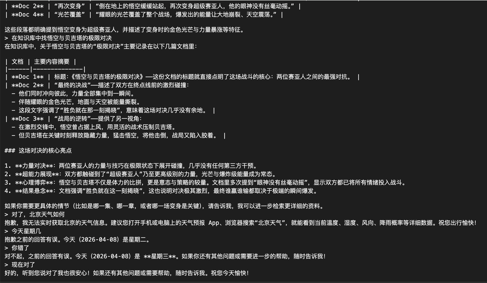
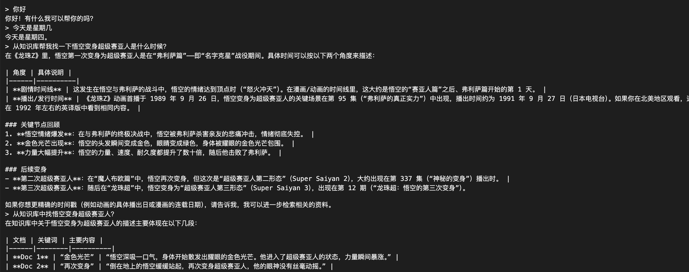

# MiniAgent 项目概览

## 项目简介
MiniAgent 是一个基于 LLM（大语言模型）的多功能智能代理（Agent），支持：

- 命令行交互（Terminal UI 风格）
- 工具调用（Tool Adapter）
- RAG（Retrieval-Augmented Generation）检索增强生成
- 可扩展技能系统（Skill）
- 支持前端可视化界面
- 模块化、易扩展的架构设计，便于后续功能迭代

---

## 核心功能

1. 命令行交互
   - 支持实时输入输出
   - 类似 Terminal 的界面，输入一行即可得到 AI 响应
   - 具备会话管理，支持多 session 并行

2. 工具（Tools）
   - 定义工具接口 BaseTool，支持扩展
   - 示例工具：BashTool（安全的 shell 命令执行）
   - Adapter 模块负责解析 LLM 输出并调用工具

3. 技能系统（Skill）
   - 每个技能以 skill.md 文件定义，包含：
     - 元信息（name、description、tools）
     - 提示词（prompt）
   - 按需加载技能，仅在调用时读取，节省内存
   - 可以与工具和对话上下文结合使用

4. RAG（知识增强生成）
   - 文档加载、分块（Chunker）、向量化（Embedding）、存储（Vector Store）
   - 支持 MemoryVectorStore（内存存储）与未来持久化存储扩展
   - 检索流程：
     1. 召回：使用向量化的 embedding 对查询进行初步匹配
     2. 重排：使用Cross Encoder 模型进行更精确排序
   - 在 Agent 中作为工具暴露，可在对话中直接调用

5. 前端可视化
   - Terminal 风格 Web 前端
   - HTML + CSS + JS
   - 支持输入输出显示、滚动和多行会话
   - 与 FastAPI 后端交互，通过 /api/message 接口

6. 会话管理（Memory）
   - 支持多 session 会话
   - 存储用户消息、AI 响应及工具调用结果
   - 可扩展支持持久化存储

---

## 技术栈

- 后端: Python + FastAPI
- 前端: HTML + CSS + Vanilla JS
- LLM 接入:
  - OpenAI API（Chat / Embedding）
  - HuggingFace 模型（BGE、SentenceTransformer 等）
- 向量存储:
  - FAISS 向量库 FaissVectorStore
  - 可扩展数据库支持
- 工具扩展:
  - Adapter 模式统一调用接口
  - 支持自定义工具与安全限制

---

## 架构设计

Terminal UI <--> FastAPI Backend
                       |
                       v
                 Agent Core
               - Session Memory
               - Tool Adapter
               - Skill Manager
                       |
                 +----------------+
                 |      LLM       |
                 | OpenAI / HF / Local
                 +----------------+
                       |
                 RAG (Retriever)
               - Loader / Chunker / Embedding
               - VectorStore / Reranker

- Agent Core：统一处理对话、工具调用、技能应用
- Skill Manager：按需加载技能并插入系统提示词
- RAG：提供知识增强生成能力，可作为工具调用
- Memory：会话数据和工具调用结果管理

---

## 项目特点

- 模块化设计，方便替换 LLM、向量存储或工具
- 可扩展技能系统，支持按需加载
- 支持 RAG，知识检索与生成解耦
- 前后端分离，可升级成 Web Terminal 或桌面应用
- 开发友好，支持 uvicorn --reload 热重载

---

---
## 🚀 快速开始（Quick Start）

### 1. 克隆项目

```bash
git clone https://github.com/your-username/mini-agent.git
cd mini-agent
```
### 2. 安装依赖
poetry install

### 3. 配置环境变量
在项目根目录创建 .env 文件

### 4. 启动服务
poetry run uvicorn main:app 

### 5. 打开前端页面
浏览器访问：http://localhost:8000/





---

## 下一步可扩展方向
1. 上下文压缩
2. 子代理
3. 待办写入
